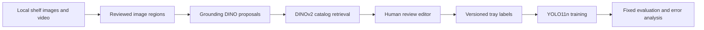

# Shelf Vision

A local computer-vision experiment for detecting physical display trays on retail shelves, retrieving product candidates, and reviewing model suggestions. It combines a React/FastAPI annotation tool, pretrained vision models, versioned labels, and controlled YOLO training experiments.

The central finding: correcting the detection target and retraining reduced false detections substantially, but dense wide-angle shelves remained difficult.

## Results

The final comparison used the same seven validation crops, containing 134 trays, at confidence 0.035 and matching IoU 0.5.

| Model | True positives | False positives | Missed trays | Precision | Recall |
| --- | ---: | ---: | ---: | ---: | ---: |
| Original YOLO11n checkpoint | 13 | 45 | 121 | 22.4% | 9.7% |
| Tray-focused YOLO11n checkpoint | 13 | 7 | 121 | 65.0% | 9.7% |

False positives fell **84.4%**, while recall remained unchanged. The new checkpoint gained four matches on wide views but lost four on closer views. It failed the predeclared recall-improvement criterion and was not promoted to the editor default.

These are development-validation results from two visits to one store, not an untouched independent test. Some annotations were proposal-assisted, and some tray classifications retain assistant review rather than individual human confirmation. Labels and training data changed together, so their separate effects cannot be inferred from this run. See the [full experiment report](docs/phases/02-tray-retraining-results.md).

## How it works



- **Grounding DINO Tiny** proposes boxes from text prompts without a custom detector training set.
- **DINOv2 Small** embeds product crops for similarity-based retrieval against catalog references. It supplies candidate identities, not object detections or calibrated probabilities.
- **YOLO11n** learns a compact, one-class detector from reviewed labels. The final target is one physical tray per box, not an individual package or arbitrary product group.
- **React + FastAPI + SQLite** provide box editing, proposal review, occupancy and identity labels, revision checks, and saved audit decisions.

The editor supports sticky box drawing, corner resizing while drawing, navigation autosave, frame confirmation, and explicit proposal acceptance. New boxes default to occupied with unknown identity. Model reruns do not replace reviewed corrections.

## Experiment sequence

1. Build a local catalog and evaluate pretrained detection plus retrieval.
2. Review the first visit, train YOLO11n, and calibrate a detection threshold on development data.
3. Evaluate a second visit with the locked threshold; identify a mismatch between broad display-area labels and the intended physical-tray target.
4. Audit the target definition and test higher resolution, overlapping tiles, and a short video-tracking pilot.
5. Resolve uncertain labels, freeze 222 tray labels across 19 crops, and run one 60-epoch tray-focused training experiment.

The scale alternatives failed their fixed improvement gate. The video pilot did not establish reliable tracking or an accuracy benefit. [Experiment index](PROJECT.md) links the protocols and reports, including unsuccessful approaches.

## Install and verify

Python 3.12 and Node.js 24 were used. Dependencies are locked in `uv.lock` and `web/package-lock.json`.

```sh
uv sync --locked
npm --prefix web ci
uv run pytest -q
npm --prefix web test
npm --prefix web run build
```

The automated tests use synthetic fixtures and do not require the store footage or model weights. The media extraction workflow requires macOS 15+, Swift/Xcode command-line tools, and `ffprobe`; inference and training were exercised locally on Apple Silicon. Other platforms have not been verified.

## Run with data

**This public repository contains code, configuration, and experiment reports, but does not include the captured footage, reviewed databases, catalog images, frozen datasets, generated overlays, or model checkpoints.** A clean checkout can run tests, but cannot reproduce the reported numbers or launch the populated editor without those inputs.

The provided seed configurations refer to the original capture filenames and coordinates. They are not a generic dataset. Adapt them for your own footage or restore the corresponding local artifacts before running the [data preparation and editor instructions](docs/USAGE.md).

With `data/manifests/catalog.json` and the prepared frame manifests available:

```sh
uv run python -m shelf_vision.editor_api
```

Open `http://127.0.0.1:8765`. The server is intended for one local operator and binds to loopback. Model weights download on first use where supported; inference runs locally. Audit pages require their corresponding frozen audit artifacts.

## Repository layout

| Path | Contents |
| --- | --- |
| `src/shelf_vision/` | Media preparation, inference, evaluation, training, editor API, audit persistence |
| `web/` | React annotation interface |
| `configs/` | Model settings and capture-specific seed metadata |
| `scripts/` | Experiment and preparation entry points |
| `tests/` | Synthetic-fixture tests for labels, evaluation, persistence, and geometry |
| `docs/phases/` | Experiment protocols, implementation notes, and measured results |

## Limits and future experiments

Tray coverage is inadequate for automatic inventory. Tray detection does not count individual products or reveal hidden stock. Product retrieval also remains experimental. No annotation-speed improvement, robust multi-frame fusion, or iPhone runtime has been demonstrated. Core ML export and raw-output parity were tested as engineering probes, not as a deployed phone application.

## Design alternatives and paths forward

The implemented baseline separates localization from identity: Grounding DINO proposes regions, and DINOv2 retrieves visually similar catalog references. The custom YOLO source currently supplies boxes only. This separation made detection and recognition errors independently measurable and allowed catalog references to change without retraining a SKU classifier.

The following alternatives are candidates for future experiments. They have not been shown to outperform the current system on this dataset.

| Alternative | When it would be useful | Tradeoff and evidence needed |
| --- | --- | --- |
| **One YOLO class per SKU** | A stable catalog with enough labeled examples of each product, where direct box-and-identity predictions are useful | Requires maintaining classes as products change. Compare per-SKU detection and performance on unseen products against detection plus retrieval. |
| **YOLO detection followed by catalog retrieval** | A changing catalog where new products should be added through reference images | Integrate the currently separate YOLO proposal path with retrieval. Measure correct localization and identity together, since crop errors can degrade matching. |
| **Multiple reference views per product** | Side-facing, tilted, or partially obscured packages differ from the current front-facing references | Requires verified catalog views. Test whether additional references improve retrieval without increasing false acceptance of unfamiliar products. |
| **Product-specific embedding training** | Generic DINOv2 features confuse similar packaging or product variants | Needs verified matching pairs and difficult nonmatching examples. Evaluate on held-out views and unfamiliar products to check for overfitting. |
| **OCR or barcode evidence** | Readable text or codes can distinguish visually similar products | Glare, angle, and small text can make these signals unavailable. Measure coverage and identity accuracy, including a fallback when text or codes cannot be read. |
| **Tray segmentation** | Exact visible boundaries or tray shape matter more than rectangular localization | Requires more detailed labels and a suitable definition for occluded boundaries. Compare boundary quality, annotation effort, and runtime. |
| **A larger detector or scale-aware training** | Small, dense trays remain difficult after label consistency and data coverage improve | Increases compute and may overfit limited data. Compare recall by object size at a fixed false-positive and latency budget. Higher-resolution inference and tiling were already tested; those particular configurations failed the gate. |
| **Multi-frame association and evidence fusion** | Different video frames expose complementary tray boundaries or product views | Requires reliable camera-motion handling and persistent tray IDs. Measure unique-tray recall, duplicate tracks, ID switches, and identity accuracy. The initial tracker did not establish an accuracy benefit. |
| **Native iPhone inference** | Live camera feedback or operation without a Mac is required | Requires validating the selected checkpoint's export, preprocessing, box decoding, and camera-coordinate mapping. Measure accuracy, end-to-end latency, and sustained device behavior; the Mac export probe does not establish these. |

### Proposed experiment sequence

1. **Improve the evidence first.** Add diverse medium and close views of missed trays, verify physical-tray boundaries, and preserve reviewed negative crops. Keep every source video within one partition.
2. **Isolate the next change.** Select one intervention and declare its comparison and acceptance criteria before running it. For retrieval, start with verified multi-view references; for detection, compare a data or training change against the frozen tray checkpoint. Avoid changing labels, architecture, and thresholds simultaneously if the goal is to identify what caused an improvement.
3. **Evaluate the complete workflow.** Report detection precision and recall, correctly localized product identities, unfamiliar-product rejection, and measured review effort. A gain in one component does not establish a gain in the whole system.
4. **Reserve a fresh assessment.** Freeze the chosen model and operating settings before evaluating an untouched third visit. Report results by view and object size alongside aggregate metrics. Treat any subsequent tuning as development, requiring another fresh assessment.

These are proposed extensions to a completed experiment. No additional model gains, reliable video fusion, or phone deployment are claimed.

## Data and model dependencies

Local media, checkpoints, databases, and generated artifacts are excluded from Git. Preserve their hashes and versioned manifests when reproducing an experiment. Third-party libraries, pretrained models, and any data you supply remain subject to their respective upstream terms; this repository does not redistribute the model weights or captured dataset.
